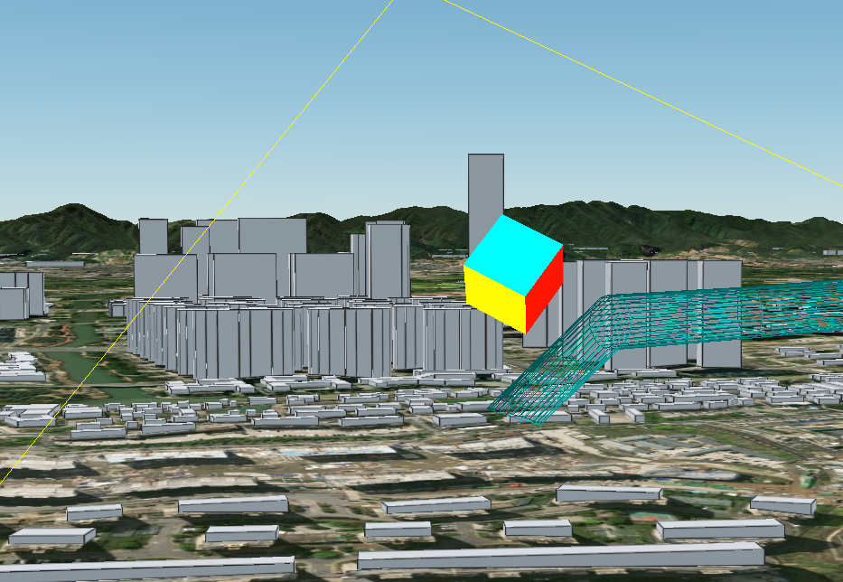
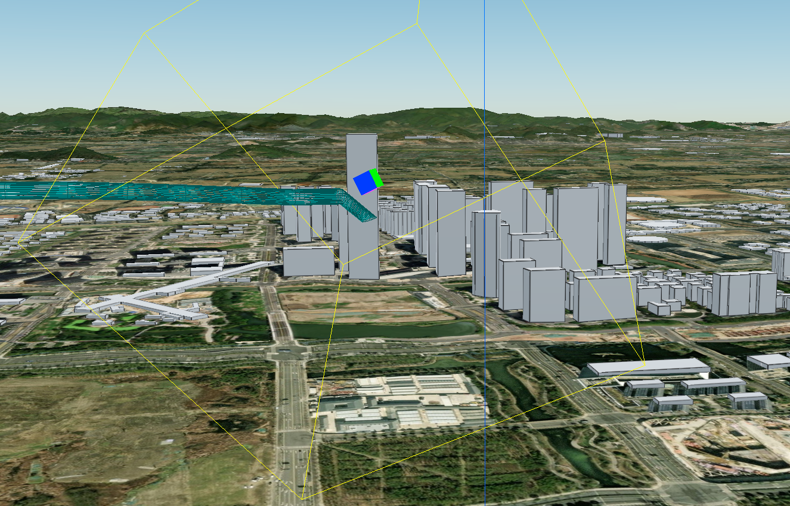

# cesium-with-three

## 步骤

- `npm install`
- `npm run dev`

## 缺点

- three中几何体对象与cesium中的对象（例如building）不存在遮挡逻辑，实际上应该存在的。例如：较高的建筑物应该会遮挡three中的几何体的
    - 最好只有在cesium无法绘制出的几何体的前提下再去使用three绘制
    - 两个场景绘图上下文（context）完全分离的，`遮挡关系`、`光照`、`阴影`、`后期特效`、`交互`等等都是两套东西，并没有真正的融合。
- 只是两个canvas画布的叠加

## 完全分离的两个上下文

遮挡关系不存在

